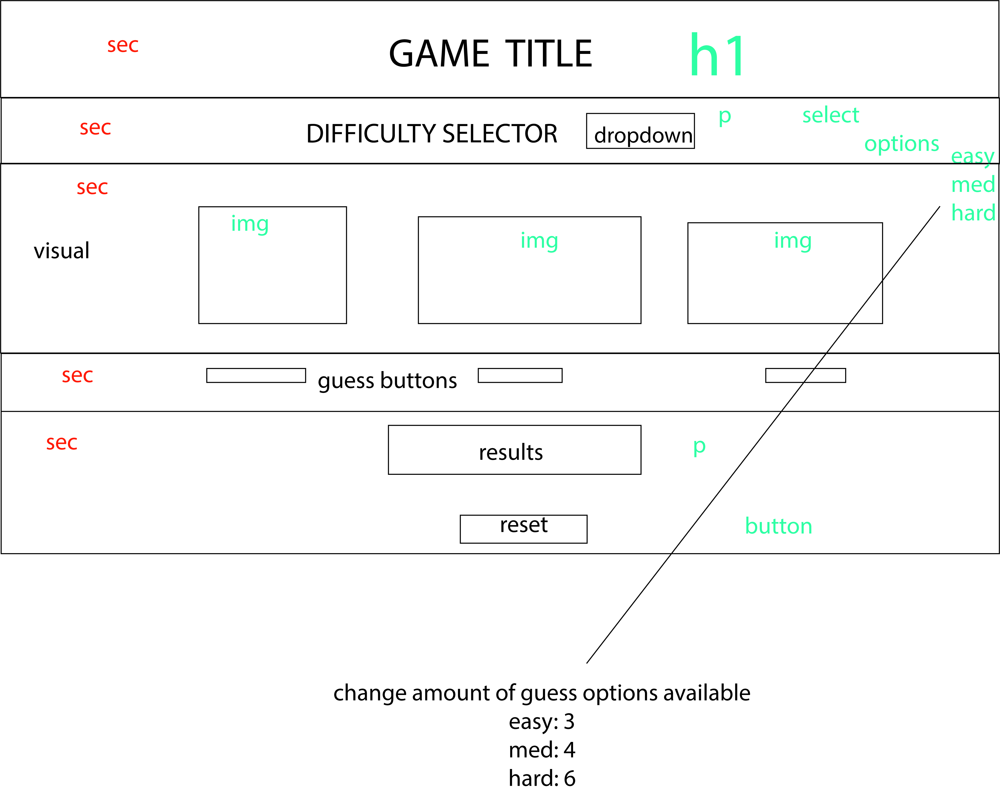

# Shell Game

## EVENTS
1) difficulty dropdown
-  easy, med, hard
- change amount of guess options on selection
2) guess option button click
- reset visuals
- increase guess total
- generate random object location
- take location and change correct selection to new image
- change wrong selections to new image
- add win notification
- increment wins on correct userGuess
- display game stats in results
3) reset button click
- resets all game display stats
- resets all image changes